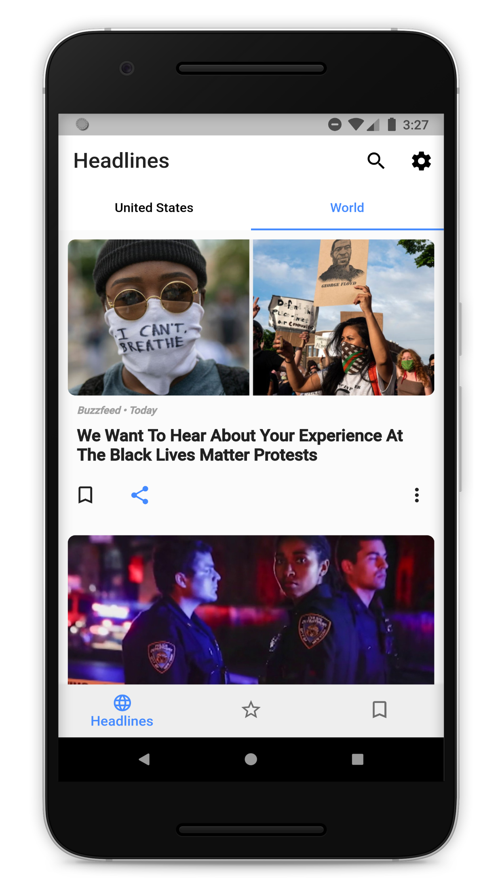
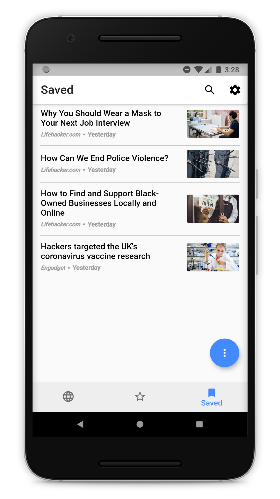
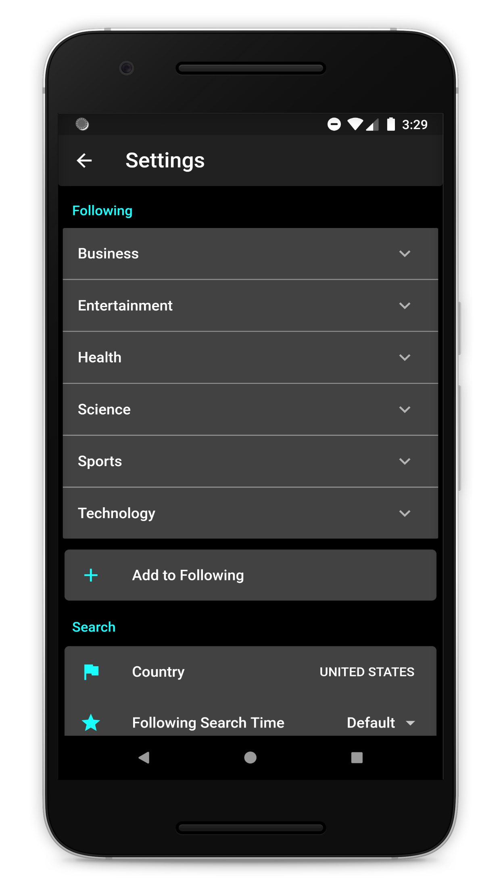

# MyNews 

A fully customize & personalize news app.

## Screenshots

 

 

 

## Technologies

### Front-end

- **Flutter SDK**
- **ScopedModel for state management**

### Storage

 - **SQLite**
 - **Shared preferences**

### Back-end

- **Firebase**
-  **News API** - [newsapi.org](https://newsapi.org/)

# Author 🙋

-   **Omer Gamliel** - [LinkedIn](https://www.linkedin.com/in/omer-gamliel-6a813a188/)
